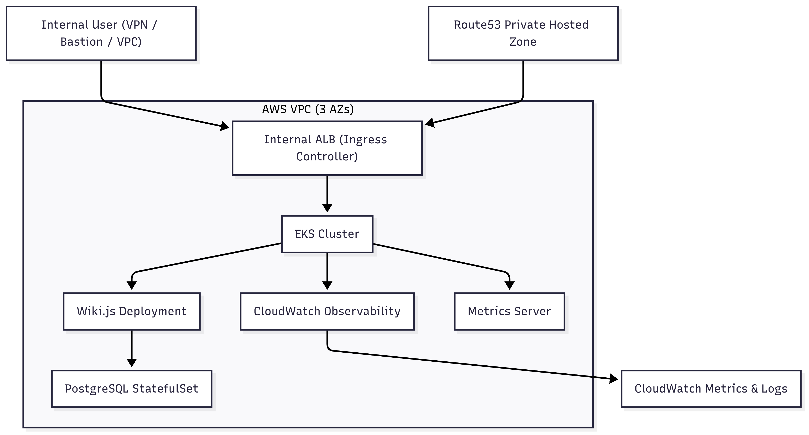

## Description
### Scenario

Your company is building an internal knowledge management platform for enterprise teams. The goal is to allow employees to collaborate on documentation, store company policies, and manage technical knowledge in a structured way.

To achieve this, your team has chosen [Wiki.js](https://js.wiki/), an open-source, self-hosted wiki platform that provides a powerful editor, authentication options, and content organization features.

### Objective

Your task is to design and deploy the infrastructure required to host Wiki.js on a cloud provider of your choice (AWS, GCP, or Azure) using Infrastructure as Code (Terraform, CDKs, Pulumi or cloud-specific IaC tools).

### Requirements

Your deployment should ensure the following:

- Reliability: The solution should be highly available and able to handle multiple users.
- Security: The infrastructure should follow security best practices.
- Scalability: The deployment should accommodate growth over time.
- Observability: The system should have monitoring, logging, and alerting capabilities.
- Automation: The entire setup should be automated using IaC.

### Considerations

- Compute: Decide how you will run Wiki.js.
- Storage: Consider database and file storage requirements.
- Networking: Ensure the system is securely accessible.
- Scaling: Think about how to handle traffic spikes.
- Monitoring: Implement basic observability.

### Deliverables

1. Infrastructure as Code (IaC) implementation.
2. Architecture diagram showing the relevant components.
3. Deployment documentation, including instructions for setup and teardown.
4. Security considerations for handling sensitive data, authentication, and access control.

### Optional Resources

- [Wiki.js](https://js.wiki/)
- [Wiki.js Documentation](https://docs.requarks.io/)
- [Wiki.js GitHub Repository](https://github.com/Requarks/wiki)

### Implementation Overview

- VPC with public and private subnets (3 per AZ by default)
- EKS Cluster deployed into private subnets with managed worker nodes
- Wiki.js deployed via Helm chart, with PostgreSQL StatefulSet for persistence
- Ingress managed by an internal ALB, configured with a self-signed certificate in ACM
- CloudWatch Observability add-on for cluster logs and metrics
- Metrics Server add-on



## Setup Instructions
Make sure to have the below prerequisites (same goes for Teardown procedure):
- AWS CLI configured
- Terraform installed
- Helm installed
- kubectl installed

1. Login to your AWS account programmatically, so Terraform will be able to create resources on your behalf.
2. Run:
```
./create_infra.sh
```
This will create the entire setup of the Wiki.js app on your AWS account using Terraform.
It'll first generate a self-signed certificate that will be used by the app's Kubernetes Ingress for secure HTTPS communication.

A VPC will be created, where the app will be internally accessible.
The app URL will be displayed at the end of deployment.

### Teardown

Run:
```
./delete_infra.sh
```
This will delete the Terraform setup.

### Some Enterprise-Grade Improvements

- Use an external RDS (multi-AZ for HA) instead Helm chart based
- Use AWS Private CA instead of self-signed cert
- Add HPA for the Wiki.js deployment
- Add Karpenter for cluster autoscaling